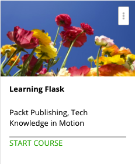

```
Roberto Nogueira  BSd EE, MSd CE
Solution Integrator Experienced - Certified by Ericsson
```

# Learning Flask



With a growing skills gap, the need for talented developers is greater than ever before. A basic grounding in building apps with a framework as minimalistic, powerful, and easy-to-learn as Flask will be a useful skill to launch you on a career as an entrepreneur or web developer. Flask is a Python micro-framework that makes web application development as easy as saying it.

This course will give you a basic grounding in the fundamental concepts of web development, as well as the hands-on experience you require to successfully build web apps with Flask.

We'll start by turning your computer into a modern development machine. Next, we'll move beyond static websites and develop a powerful database-backed dynamic Flask app. We won't stop there, because we'll also cover how to implement a full authentication system.

Finally, we'll extend the app's functionality by learning how to integrate it with third-party APIs.

When you finish this course, you will be fully equipped to build your very own custom web apps.

**About the Author**

**Lalith Polepeddi** has been working with Flask since discovering it to be an easy way to learn about web development. He's written about Flask for Tuts+ and TechPro. Aside from Flask, Lalith is interested in applying computer science to address problems in parallel domains, such as biology.

**What are the requirements?**

* Some basic familiarity with Python will help you understand the code more easily.

**What am I going to get from this course?**

* Set up a development environment with all the necessary software to develop Flask apps
* Create robust databases with PostgreSQL to safely store user data for your dynamic websites
* Build an authentication and authorization system using Flask-Login and Flask- Oauth to protect your pages from improper access
* Use Flask extensions such as Flask-Gravatar, Flask SSLify, and more to add a wide range of functionalities to your app
* Integrate the Wikipedia API to build a location-based service

**What is the target audience?**

This video course is for new developers who want to explore Flask and build custom web applications quickly and easily.

## Contents

```
[ ]Section: 1 Setting Up the Environment
	1. The Course Overview 1:59
	2. Text Editor 2:20
	3. Command-line Interface 1:52
	4. Version Control 1:54
	5. Database 1:02
	6. Flask 2:26
	7. Heroku 1:11
	8. Summary 0:58

[ ]Section: 2 Getting Started
[ ]Section: 3 Storing Data
[ ]Section: 4 Signing Up
[ ]Section: 5 Logging In and Logging Out
[ ]Section: 6 Authorization/User Roles
[ ]Section: 7 Bookmarking Places
```
